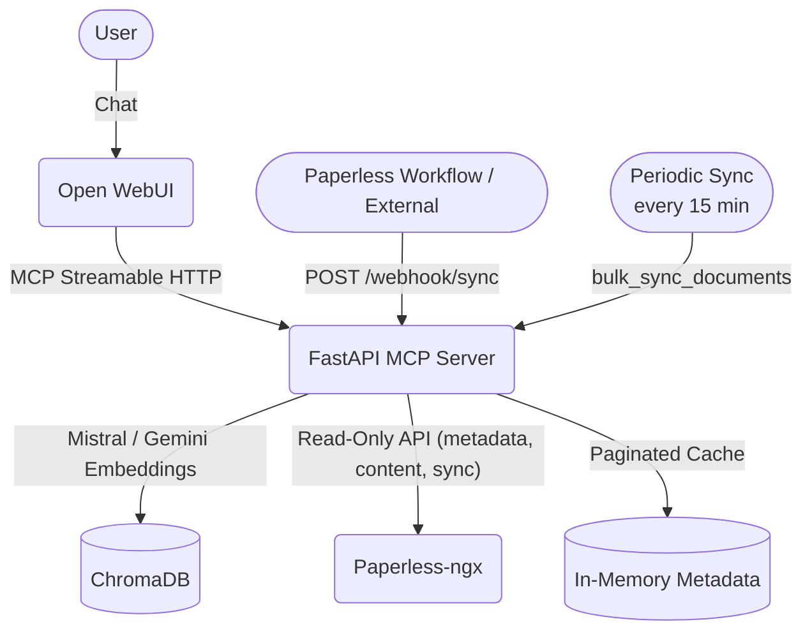

[](https://github.com/hensing/searchless-ngx/actions/workflows/ci.yml)

# 🪄 Searchless-ngx

<p align="center">
  
</p>

> **Stop searching your documents. Start asking them.** An Agentic RAG MCP Server for Paperless-ngx.

**Less searching. More finding.** Searchless-ngx transforms your Paperless-ngx instance from a static, keyword-based archive into an intelligent, conversational agent. By leveraging the Model Context Protocol (MCP) and Agentic RAG, it allows modern LLMs to natively understand, search, filter, and reason over your documents.

### 🤔 About the Name
If **Paperless** freed you from the burden of physical paper, **Searchless** frees you from the burden of manual searching.
* **Serverless** means you don't manage servers.
* **Passwordless** means you don't type passwords.
* **Searchless** means you don't click through filters or skim 20-page PDFs anymore. You just ask your assistant a question, and it does the heavy lifting for you. The `-ngx` pays homage to the incredible Paperless-ngx project that makes all of this possible. 

*(Note: Under the hood, the technical service is named `paperless-mcp-server` to provide optimal contextual grounding for the AI).*

> [!IMPORTANT]
> This project assumes that your documents are properly parsed (OCR) and have high-quality tags assigned within Paperless-ngx. Searchless-ngx is a retrieval and reasoning layer, not an organization tool. If your library needs better metadata or automated tagging, please check out [Paperless-GPT](https://github.com/icereed/paperless-gpt).


## ✨ Key Features

- **Agentic RAG**: Equips your LLM with tools to query, filter, and summarize your personal documents.
- **Hybrid Search Strategy**:
    - **Exact Metadata API**: Leverage Paperless-ngx's powerful filtering (tags, correspondents, dates) for precise retrieval.
    - **Semantic Vector Search**: Use ChromaDB and Mistral embeddings (Google Gemini optional) to find documents based on *meaning* and *context* (e.g., "software subscriptions", "food receipts").
- **Optimized for Open WebUI**:
    - **Strict JSON Schema**: Zero `anyOf` or `null` types to ensure 100% compatibility with experimental MCP parsers.
    - **Interactive Cards**: Search results are presented as beautiful Markdown cards with clickable titles and metadata.
- **Read-Only**: Zero destructive actions. It uses existing OCR text and never downloads binary PDFs.
- **Smart Sync**: Startup sync uses a watermark to fetch only new/changed documents from Paperless in seconds. Periodic background sync (default: every 15 min, configurable) keeps the index continuously up to date. Webhook support for real-time ingestion of individual documents. Manual full-sync via `POST /sync/all`.
- **Search Resilience**: Proactive fallback strategies ensure the LLM finds documents even when initial filters are too restrictive.

## 🏗️ Architecture



## 🚀 Setup & Installation

### 1. Prerequisites
- Docker & Docker Compose
- Paperless-ngx instance
- A Mistral API Key (default provider) **or** a Google Gemini API Key (alternative)

### 2. Environment Configuration
Copy `.env.example` to `.env` and configure:
```bash
cp .env.example .env
```
| Variable | Description |
| :--- | :--- |
| `PAPERLESS_URL` | Your Paperless-ngx base URL. |
| `PAPERLESS_TOKEN` | API Token from Paperless settings. |
| `LLM_PROVIDER` | Umbrella provider: `mistral` (default), `google`, `openai` or `ollama`. |
| `EMBEDDING_PROVIDER` / `CHAT_PROVIDER` | (Optional) Override either axis for best-of-breed. Each falls back to `LLM_PROVIDER`. |
| `MISTRAL_API_KEY` / `GEMINI_API_KEY` / `OPENAI_API_KEY` | API keys — required only for the cloud provider(s) actually in use (`ollama` needs none). |
| `OLLAMA_BASE_URL` / `OPENAI_BASE_URL` | (Optional) OpenAI-compatible endpoints. Ollama defaults to `http://localhost:11434/v1`. |
| `EMBEDDING_MODEL` / `CHAT_MODEL` | (Optional) Override the default models per axis. |
| `PAPERLESS_PUBLIC_URL` | (Optional) URL used for clickable links in chat. Defaults to `PAPERLESS_URL`. |
| `LOG_LEVEL` | (Optional) Log verbosity: `INFO` (default) or `DEBUG`. |
| `MAX_CHUNKS_PER_DOC` | (Optional) Limit segments per document (Default: 100 ≈ 25 pages). |
| `BULK_SYNC_LIMIT` | (Optional) Cap initial ingestion to the X newest documents. |
| `SYNC_INTERVAL_MINUTES` | (Optional) Periodic background sync interval in minutes (Default: 15). Set to `0` to disable. |

#### Provider selection (Mistral / Google / OpenAI / Ollama)

`LLM_PROVIDER` is the umbrella default (**Mistral**: `mistral-embed` embeddings +
`mistral-small-latest` for fuzzy matching). Set it to `google`, `openai` or `ollama` to switch.
`openai` and `ollama` share one OpenAI-compatible client, so any OpenAI-compatible endpoint
(vLLM, TEI, LM Studio, …) works by pointing `OPENAI_BASE_URL` / `OLLAMA_BASE_URL` at it.

**Best-of-breed:** the embedding and chat axes can be split independently via
`EMBEDDING_PROVIDER` and `CHAT_PROVIDER` (each falls back to `LLM_PROVIDER`). Google's
`gemini-embedding-001` leads multilingual retrieval benchmarks, so a common combination is
Google embeddings + Mistral (EU) chat:

```bash
EMBEDDING_PROVIDER=google   # stronger retrieval
CHAT_PROVIDER=mistral       # EU-hosted chat
# both MISTRAL_API_KEY and GEMINI_API_KEY required
```

> ⚠️ **Switching the embedding provider requires rebuilding the vector DB.** Embeddings from
> different models live in different vector spaces (and dimensions: Mistral = 1024, Gemini =
> 3072), so the existing index is unusable. Wipe the `chroma_data` volume and let the startup
> sync re-embed everything:
> ```bash
> docker compose down
> docker volume rm $(docker compose config --volumes | grep chroma)
> docker compose up -d
> ```

#### Fully local & private: Qwen3 embeddings + Mistral Small 24B on Ollama

Run everything on your own machine (e.g. a MacBook Pro M4 with ≥32 GB RAM). Install
[Ollama](https://ollama.com) **natively** on the host — Docker on macOS has no GPU access, so
the containers should call out to the host's Ollama via `host.docker.internal`.

```bash
# 1. On the host: install Ollama (macOS)
brew install ollama

# 2. Pull the models (pin explicit tags — see table below) and expose Ollama to containers
ollama pull qwen3-embedding:0.6b
ollama pull mistral-small:24b
OLLAMA_HOST=0.0.0.0 ollama serve        # bind so Docker can reach it

# 3. In .env
LLM_PROVIDER=ollama
OLLAMA_BASE_URL=http://host.docker.internal:11434/v1
EMBEDDING_MODEL=qwen3-embedding:0.6b
CHAT_MODEL=mistral-small:24b
```

**Embedding model options** (always pin a tag — bare `qwen3-embedding` / `:latest` = 8B):

| Tag | Download | Dimensions | When to use |
| :--- | :--- | :--- | :--- |
| `qwen3-embedding:0.6b` | ~0.6 GB | **1024** | **Recommended** — fast, lean, great for a personal archive |
| `qwen3-embedding:4b` | ~2.5 GB | 2560 | More headroom if you want it |
| `qwen3-embedding:8b` | ~4.7 GB | 4096 | Max quality; larger index + slower sync, overkill for most |

No API key is needed for `ollama`. Embeddings stay 100 % on-device — nothing leaves your
machine. (You can also mix, e.g. `EMBEDDING_PROVIDER=ollama` for private local embeddings while
keeping `CHAT_PROVIDER=mistral` for the cloud chat.)

> 💡 The embedding dimension is baked into the ChromaDB collection. Switching tags (e.g.
> `:0.6b` → `:8b`) changes the dimension and requires a vector-DB rebuild.

**Model loading & memory:** Ollama loads a model into memory on first use and automatically
unloads it after **5 minutes idle** (`OLLAMA_KEEP_ALIVE`, default `5m`) to free RAM. Since the
periodic sync runs every 15 min, the embedding model is unloaded between runs and reloaded on
each sync — for `qwen3-embedding:0.6b` that reload is negligible (well under a second), so the
**default `5m` is a good fit and needs no change**. If you'd rather keep it permanently warm,
set `OLLAMA_KEEP_ALIVE=-1` on the host (costs ~0.6 GB RAM for the 0.6B model).

### 3. Docker Compose
Start the agent and Open WebUI:
```bash
docker compose up -d
```

### 4. Connect to Open WebUI
1. Open `http://localhost:8080`.
2. Go to **Settings > Connections > MCP Servers**.
3. **Preferred Method**: Click the import button and select `scripts/webui-connection.json`.
4. **Manual Method**: Add a new server with type `MCP Streamable HTTP` and URL `http://mcp-server:8001/mcp`.

For detailed Open WebUI instructions, see [WEBUI_SETUP.md](WEBUI_SETUP.md).

## 💡 Usage Examples

### Listing Documents
- *"List the last 5 documents from Amazon."* (Uses exact metadata search)
- *"Show me my most recent invoices."* (Uses empty query to fetch by date)

### Conceptual Search (Semantic)
- *"Find all software subscriptions I have."* (Finds "Netflix", "Adobe", "Microsoft" even if "subscription" isn't in the title)
- *"Where are my food receipts from my last trip to Berlin?"* (Combines location context with document meaning)

### Data Extraction
- *"How much did I spend on mobility in February 2024?"* (LLM iterates through scouter/train invoices and calculates the sum)
- *"Summarize the cancellation terms for my gym contract."* (LLM uses `get_document_details` to read the full OCR text)

## 🛠️ Development & Testing

### Diagnostic Tools
Use the raw protocol checker to verify the server's output:
```bash
docker exec paperless-mcp-server python scripts/test_mcp_raw.py
```

### Test Coverage
Run the test suite using `uv`:
```bash
uv run pytest
```

## 👤 Author
Developed and maintained by [Dr. Henning Dickten](https://github.com/hensing) ([@hensing](https://github.com/hensing)).

## ⚖️ License
Licensed under the GPLv3.
