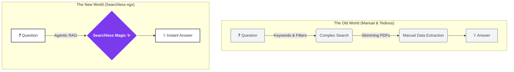
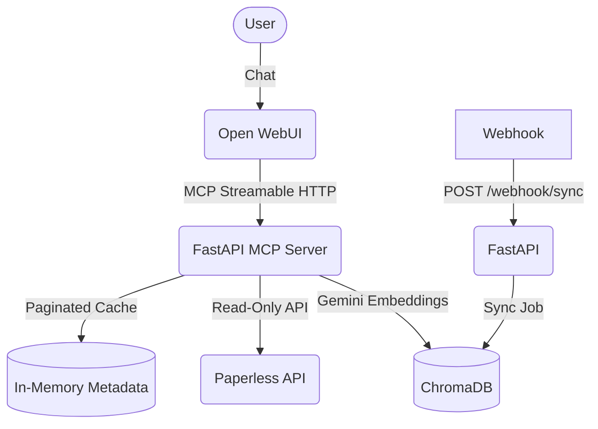

# 🪄 Searchless-ngx

[](https://github.com/hensing/searchless-ngx/actions/workflows/ci.yml)

> **Stop searching your documents. Start asking them.** An Agentic RAG MCP Server for Paperless-ngx.

**Less searching. More finding.** Searchless-ngx transforms your Paperless-ngx instance from a static, keyword-based archive into an intelligent, conversational agent. By leveraging the Model Context Protocol (MCP) and Agentic RAG, it allows modern LLMs to natively understand, search, filter, and reason over your documents.

### 🤔 About the Name
If **Paperless** freed you from the burden of physical paper, **Searchless** frees you from the burden of manual searching.
* **Serverless** means you don't manage servers.
* **Passwordless** means you don't type passwords.
* **Searchless** means you don't click through filters or skim 20-page PDFs anymore. You just ask your assistant a question, and it does the heavy lifting for you. The `-ngx` pays homage to the incredible Paperless-ngx project that makes all of this possible. 

*(Note: Under the hood, the technical service is named `paperless-mcp-server` to provide optimal contextual grounding for the AI).*

### 🌍 The Philosophy: Old World vs. New World

We built Searchless-ngx because the traditional way of interacting with document archives is outdated and friction-heavy. 



## ✨ Key Features

- **Agentic RAG**: Equips your LLM with tools to query, filter, and summarize your personal documents.
- **Hybrid Search Strategy**:
    - **Exact Metadata API**: Leverage Paperless-ngx's powerful filtering (tags, correspondents, dates) for precise retrieval.
    - **Semantic Vector Search**: Use ChromaDB and Gemini embeddings to find documents based on *meaning* and *context* (e.g., "software subscriptions", "food receipts").
- **Optimized for Open WebUI**:
    - **Strict JSON Schema**: Zero `anyOf` or `null` types to ensure 100% compatibility with experimental MCP parsers.
    - **Interactive Cards**: Search results are presented as beautiful Markdown cards with clickable titles and metadata.
- **Read-Only**: Zero destructive actions. It uses existing OCR text and never downloads binary PDFs.
- **Real-Time Sync**: Webhook support for immediate ingestion of new documents.

## 🏗️ Architecture



## 🚀 Setup & Installation

### 1. Prerequisites
- Docker & Docker Compose
- Paperless-ngx instance
- Google Gemini API Key (for embeddings and/or LLM)

### 2. Environment Configuration
Copy `.env.example` to `.env` and configure:
```bash
cp .env.example .env
```
| Variable | Description |
| :--- | :--- |
| `PAPERLESS_URL` | Your Paperless-ngx base URL. |
| `PAPERLESS_TOKEN` | API Token from Paperless settings. |
| `GEMINI_API_KEY` | Google GenAI key for embeddings. |
| `PUBLIC_URL` | The URL used for generating clickable links in chat. |

### 3. Docker Compose
Start the agent and Open WebUI:
```bash
docker compose up -d
```

### 4. Connect to Open WebUI
1. Open `http://localhost:8080`.
2. Go to **Settings > Connections > MCP Servers**.
3. **Preferred Method**: Click the import button and select `scripts/webui-connection.json`.
4. **Manual Method**: Add a new server with type `MCP Streamable HTTP` and URL `http://mcp-server:8001/mcp`.

For detailed Open WebUI instructions, see [WEBUI_SETUP.md](WEBUI_SETUP.md).

## 💡 Usage Examples

### Listing Documents
- *"List the last 5 documents from Amazon."* (Uses exact metadata search)
- *"Show me my most recent invoices."* (Uses empty query to fetch by date)

### Conceptual Search (Semantic)
- *"Find all software subscriptions I have."* (Finds "Netflix", "Adobe", "Microsoft" even if "subscription" isn't in the title)
- *"Where are my food receipts from my last trip to Berlin?"* (Combines location context with document meaning)

### Data Extraction
- *"How much did I spend on mobility in February 2024?"* (LLM iterates through scouter/train invoices and calculates the sum)
- *"Summarize the cancellation terms for my gym contract."* (LLM uses `get_document_details` to read the full OCR text)

## 🛠️ Development & Testing

### Diagnostic Tools
Use the raw protocol checker to verify the server's output:
```bash
docker exec paperless-mcp-server python scripts/test_mcp_raw.py
```

### Test Coverage
Run the test suite using `uv`:
```bash
uv run pytest
```

## 📜 License
Licensed under the GPLv3.
